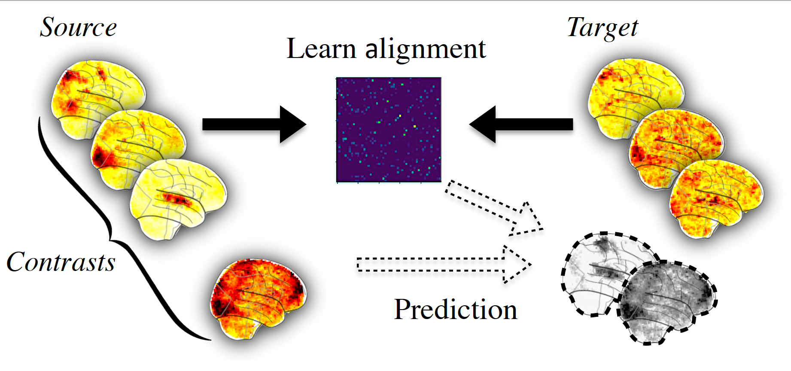

.. for doctests to run, we need to define variables that are define in
   the literal includes
    >>> # if need to do something
..
.. functional_alignment_intro:

=======================================
An introduction to functional alignment
=======================================

This section gives an introduction to the concept of functional alignment:
finding transformation between subjects to handle the functional variability.

In this documentation we use a subset of `Individual Brain Charting dataset <https://project.inria.fr/IBC/>`_ where we have a lot of functional informations on several subjects, in the form of several task-based contrast per subject.

.. topic:: **Full code example**

   The documentation here just gives the big idea. A full code example can be found on
   :ref:`sphx_glr_auto_examples_plot_pairwise_alignment.py`. If you want to work on a
   Region Of Interest see :ref:`sphx_glr_auto_examples_plot_pairwise_roi_alignment.py`.

.. contents:: **Contents**
    :local:
    :depth: 1

Inter subject variability in fMRI
==================================
In order to better understand brain function, many dataset acquire precise individual
functional images. Some rely on task and contrasts with a semantic,
(`Human Connectome Project <http://www.humanconnectomeproject.org/>`_ , `Individual Brain Charting <https://project.inria.fr/IBC/>`_),
others use complex naturalistic stimulis such as movies.
This accumulation help characterize better individual structure of brain function,
however it's hard to use precise individual informations in group study setting
because they show a lot of variability across subjects. As a first step,
let's illustrate this variability on an example.

Loading and preparing the data
------------------------------
We begin with the retrieval of images from two `Individual Brain Charting <https://project.inria.fr/IBC/>`_ subjects :

>>> from fmralign.fetch_example_data import fetch_ibc_subjects_contrasts
>>> files, df, mask = fetch_ibc_subjects_contrasts(['sub-01', 'sub-02'])

Here `files` is the list of paths for each subject and `df` is a pandas Dataframe
with metadata about each of them. We use the mask provided to define a
`Nilearn masker <http://nilearn.github.io/manipulating_images/masker_objects.html>`_
that will keep only relevant data.

>>> from nilearn.input_data import NiftiMasker
>>> masker = NiftiMasker(mask_img=mask).fit()

For each subject, for each task and conditions, our dataset contains two
independent acquisitions, similar except for one acquisition parameter, the
encoding phase used that was either Antero-Posterior (AP) or Postero-Anterior (PA).
In this part we focus only on the 'PA' images that we put apart.

>>> sub-01_pa = df[df.subject == 'sub-01'][df.acquisition == 'pa'].path.values
>>> sub-02_pa = df[df.subject == 'sub-02'][df.acquisition == 'pa'].path.values

Measure correlation between subjects images
-------------------------------------------
To evaluate the similarity between subject, let's use a simple metric: the voxelwise
correlation. That is, for each voxel we compute the correlation between its
activation profile for subject 1 and for subject 2.

>>> from fmralign._utils import voxelwise_correlation
>>> inter-subject_correlation = voxelwise_correlation(sub-02_pa, sub-01_pa, masker)

We then plot this correlation for two specific cuts.

>>> from nilearn import plotting
>>> corr_display = plotting.plot_stat_map(average_score, display_mode="z",
>>>                                       vmax=1, cut_coords=[-15, -5])
>>> corr_display.title("Initial correlation between subjects 1 and 2 images")
>>> plotting.show()

.. image:: ../auto_examples/images/sphx_glr_plot_pairwise_alignment_001.png

We can observe there is only a weak correlation between the two subjects images
which illustrate that functional signals are widely different between subject
even in simple and narrow experimental settings.

Functional alignment
=====================

The core idea of functional alignment is to handle this variablity by learning a transformation
from one subject to another.

First, we choose one **target** subject, toward which we'll transform images from a **source** subject. We use shared information to learn the transformation from source to target. We won't get now into
details about how the transformation is learnt. More details on the features
offered by fmralign are available here.

Then we can use this alignment, for example to predict some missing data of the target subject
from source subject as summarized in picture below.

To do this concretely with fmralign on our example, let's choose sub-01 as source and sub-02 as target.
The say we have the 'AP' images in common for both subjects, we only have 'PA' images for sub-01
and we want to predict it for sub-02.

Learning the transformation and predicting new data
----------------------------------------------------

As we want to learn the transformation on 'AP' images, we should retrieve these images we left aside a moment ago :

>>> sub-01_ap = df[df.subject == 'sub-01'][df.acquisition == 'ap'].path.values
>>> sub-02_ap = df[df.subject == 'sub-02'][df.acquisition == 'ap'].path.values

We align the whole brain through multiple local alignment, each applied on a piece of the brain, isolated through a functional clustering. We define the estimator used and fit it.

>>> from fmralign.pairwise_alignment import PairwiseAlignment
>>> alignement_estimator = PairwiseAlignment(alignment_method='scaled_orthogonal',
>>>                                                   n_pieces=150, mask=masker)

We learn alignment operator from subject 1 to subject 2 on 'AP' data.

>>> alignement_estimator.fit(sub-01_ap, sub-02_ap)

Now we can use this operator to align the 'PA' images from sub-01. From a machine
learning perspective, you can also interpret this as predicting sub-02 data.

>>> aligned_sub-01_pa = alignement_estimator.transform(source_test)

Measuring similarity after alignment
------------------------------------

We reuse the voxelwise correlation, to measure if aligning source subject images
improved their similarity to those of the target subject and we compare it to
our previous results.

>>> alignment_correlation = voxelwise_correlation(sub-02_pa, sub-01_pa, masker)
>>> alignment_display = plotting.plot_stat_map(average_score, display_mode="z",
>>>                                            vmax=1, cut_coords=[-15, -5])
>>> corr_display.title("Correlation between 1 and 2 after alignment")
>>> plotting.show()

.. image:: ../auto_examples/images/sphx_glr_plot_pairwise_alignment_002.png

We can observe that the correlations values are overall higher than initially,
with bigger regions well predicted. It is a sign that alignment succesfully
handled part of the inter-subject variability.
